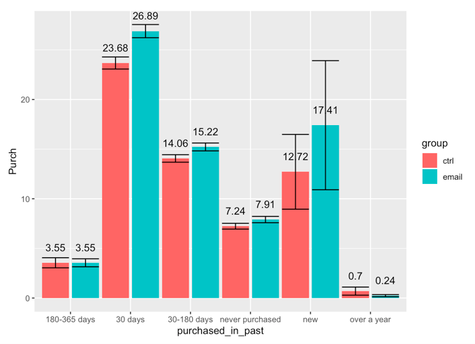

# Portfolio

## Self-Introduction
I am currently pursuing Masters in Business Analytics at the University of Rochester. My training related to analytic filed during the program include: R Programming, Predictive Analytics with Python (Machine Learning), Causal Analytics with R (A/B Testing), Social Media Analytics (NLP), Data Management, Pricing Analytics, Analytics Design (TURF & Conjoint analysis) 
  
Other than what I have learned from courses, I also experienced multiples case competitions and projects about getting insights from analyzing large datasets using multiple tools and building causal & predictive models to help address business problems. 

## Projects and Case Competition 

### Project 1:
---
[Humana-Mays 2019 Healthcare Analytics Case Competition](/Humana)
#### Description:
Analyze 7 million medical records of 20,000 patients provided by Humana to create a model aim at predict if members will continue opioid therapy six months after initial prescribing. Provide insights and suggestions to help identify members at risk for continued long term use of opioid therapies allowing for early intervention

### Project 2: 
---
[Email Marketing Experiments Project](/sample_page)
#### Description: 
Running email marketing experiments to evaluate offers prior to sending the offers to a broader set of customers; Examining the impact of an email that was intended to drive purchases and evaluate whether the promotion is effective.
  Getting insight from data to determine different potential market segmentation methods and decide what kind of customer to target with the email campaign.

#### Sample results: 
Grouped customers based on did they purchased Chard before. 
  

  
Grouped customers based on when did they make their purchase behavior or their customer features.
  

  

### Project 3:
---
[Conjoint Analysis](/project2)
#### Description:
Aim at revitalizing their product portfolio based on the opinions of potential end-users by analyzing the survey result and constructing a conjoint analysis as well as consider customer segmentation method to target customer better.
#### Sample result:
Cluster Result:
 

