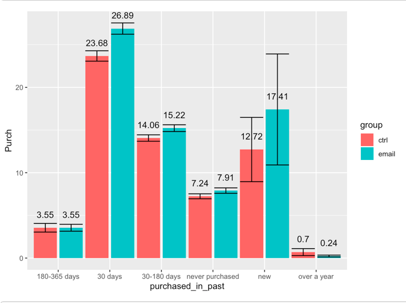

## Portfolio

---

### Introduction
I am currently pursuing Masters in Business Analytics at the University of Rochester. My training related to analytic filed during the program include: R Programming, Predictive Analytics with Python (Machine Learning), Causal Analytics with R (A/B Testing), Social Media Analytics (NLP), Data Management, Pricing Analytics, Analytics Design (TURF & Conjoint analysis) 
  
I had experience with getting insights from analyzing large datasets using multiple tools and building causal & predictive models to help address business problems. 

[Email Marketing Experiments Project](/sample_page)

#### Project description: 
Running email marketing experiments to evaluate offers prior to sending the offers to a broader set of customers; Examining the impact of an email that was intended to drive purchases and evaluate whether the promotion is effective and who to target with the email campaign.

#### Sample results: 

  
Grouped customers based on did they purchased Chard before. 
  

  
Grouped customers based on when did they make their purchase behavior or their customer features.

---
[Project 2 Title](/pdf/sample_presentation.pdf)

---
[Project 3 Title](http://example.com/)

---

### Category Name 2

- [Project 1 Title](http://example.com/)
- [Project 2 Title](http://example.com/)
- [Project 3 Title](http://example.com/)
- [Project 4 Title](http://example.com/)
- [Project 5 Title](http://example.com/)

---

---

Page template forked from <a href="https://github.com/evanca/quick-portfolio">evanca</a>

<!-- Remove above link if you don't want to attibute -->
