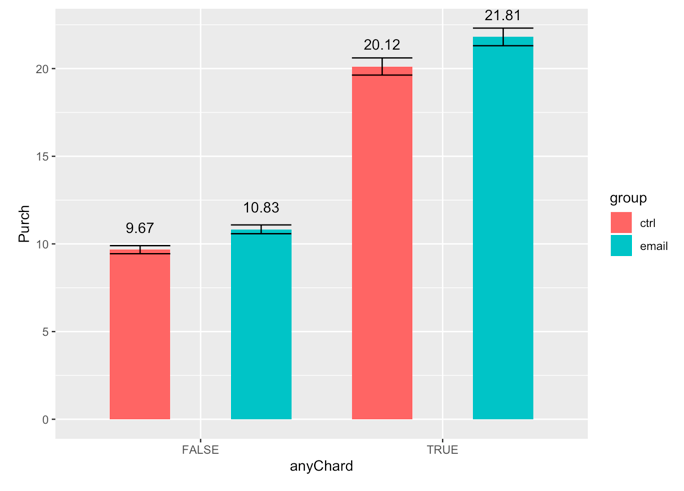
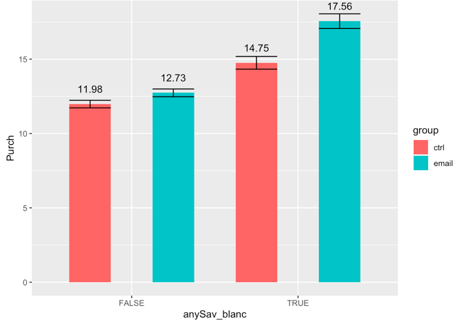

## Email Marketing Experiments Project

**Project description:** Running email marketing experiments to evaluate offers prior to sending the offers to a broader
set of customers; Examining the impact of an email that was intended to drive purchases and evaluate whether the promotion is effective and who to target with the email campaign.

### 1. Slice and dice analysis

The goal for this part is to illustrate the potential for targeting responses for this email campaign based on demographic characteristics.

#### Grouped customers based on their purchased products before. 
Graph:

Code:

```
a. Chard 
chard = 
    data_slice_2 %>%
    group_by(group,anyChard) %>%
    summarise(N = n(),Open = mean(open),Click = mean(click),Purch = mean(purch), 
              seOpen = sd(open)/sqrt(N),seClick = sd(click)/sqrt(N), sePurch = sd(purch)/sqrt(N))

ggplot(aes(fill = group, x=anyChard,y=Purch,ymax = Purch+sePurch,ymin=Purch-sePurch),data=chard)+
    geom_bar(position=dodge,stat="identity",width = 0.5)+
    geom_text(aes(label = round(Purch,2)),position=position_dodge(1),vjust=-1.6)+
    geom_errorbar(position=dodge,width = 0.5)
```
Graph: 

Code:

```
b. Sav  
sav_blanc = 
    data_slice_2 %>%
    group_by(group,anySav_blanc) %>%
    summarise(N = n(),Open = mean(open),Click = mean(click),Purch = mean(purch), 
              seOpen = sd(open)/sqrt(N),seClick = sd(click)/sqrt(N), sePurch = sd(purch)/sqrt(N))

ggplot(aes(fill = group, x=anySav_blanc,y=Purch,ymax = Purch+sePurch,ymin=Purch-sePurch),data=sav_blanc)+
    geom_bar(position=dodge,stat="identity",width = 0.5)+
    geom_text(aes(label = round(Purch,2)),position=position_dodge(1),vjust=-1.6)+
    geom_errorbar(position=dodge,width = 0.5)
```

#### Grouped customers based on when did they make their purchase behavior or their customer features.
Graph:

Code:

```
1) recent buyers vs. non-recent buyers: 
data_slice_1 = data
data_slice_1$purchased_in_past = ifelse(data_slice_1$last_purch == 0 & data_slice_1$past_purch == 0, "new",
                                 ifelse(data_slice_1$last_purch != 0 & data_slice_1$past_purch == 0, "never purchased",
                                 ifelse(data_slice_1$last_purch <= 30 & data_slice_1$past_purch != 0, "30 days",
                                 ifelse(data_slice_1$last_purch <= 180 & data_slice_1$past_purch != 0 & data_slice_1$last_purch > 30, "30-180 days",
                                 ifelse(data_slice_1$last_purch <= 365 & data_slice_1$past_purch != 0 & data_slice_1$last_purch > 180, "180-365 days", "over a year"
                                  )))))
#summary 
slice_1_avg_summary = 
    data_slice_1 %>% 
    group_by(group,purchased_in_past) %>%
    summarise(N = n(),Open = mean(open),Click = mean(click),Purch = mean(purch), 
              seOpen = sd(open)/sqrt(N),seClick = sd(click)/sqrt(N), sePurch = sd(purch)/sqrt(N))

#plot
ggplot(aes(fill=group,y=Purch,x=purchased_in_past,ymax=Purch+sePurch,ymin=Purch-sePurch),data=slice_1_avg_summary)+
    geom_bar(position=dodge,stat="identity") + 
    geom_text(aes(label = round(Purch,2)),position=position_dodge(1),vjust=-1.6)+
    geom_errorbar(position=dodge)
```
#### Grouped customers based on past purchase amount


### 2. “Individual-level” Conditional Causal Effect Estimates

The goal for this part is to build a causal forest model with all demographic characteristics, score each customer and decide to send an offer to which customer. 


For more details see [GitHub Flavored Markdown](https://guides.github.com/features/mastering-markdown/).
