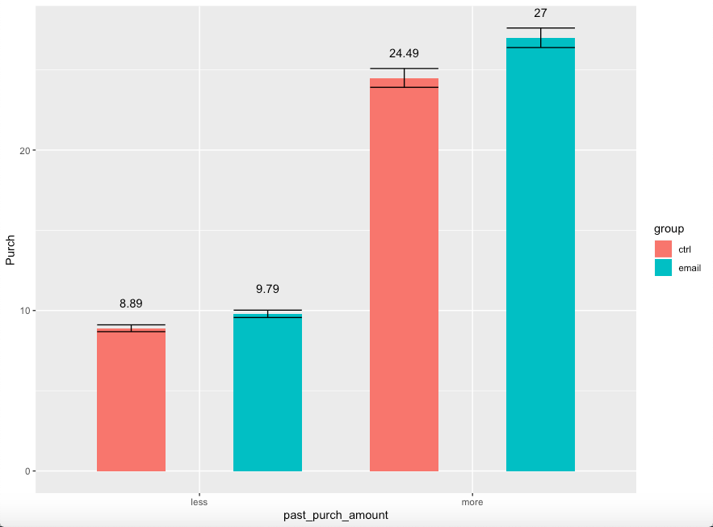
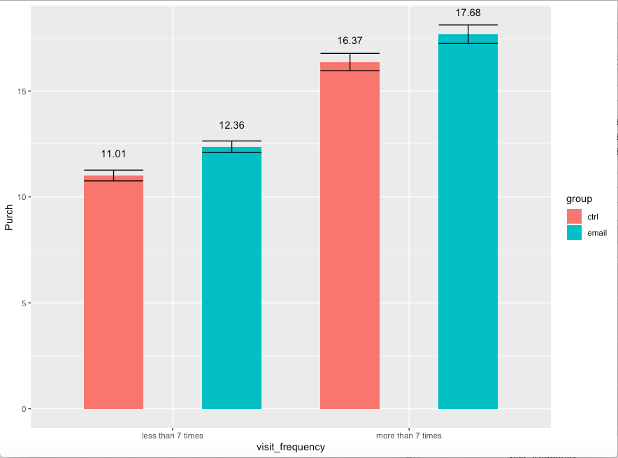

## Email Marketing Experiments Project

### Project description: 
---
The goal of this project is to evaluate whether the promotion is effective before sending it to a broader set of customers by running email marketing experiments and examining the impact of a promotion email that was intended to drive purchases. 
<br>As well as getting insight from data to determine different potential market segmentation methods and decide what kind of customer to target with the email campaign.

### Procedures:
---
**1. Slice and Dice Analysis** 

The goal for this part is to illustrate the potential for targeting responses for this email campaign based on demographic characteristics.

1) Grouped customers based on their purchased history.
<br><br>
Graph:
<br>

<br>
Code:
<br>

```
a. Chard 
chard = 
    data_slice_2 %>%
    group_by(group,anyChard) %>%
    summarise(N = n(),Open = mean(open),Click = mean(click),Purch = mean(purch), 
              seOpen = sd(open)/sqrt(N),seClick = sd(click)/sqrt(N), sePurch = sd(purch)/sqrt(N))

ggplot(aes(fill = group, x=anyChard,y=Purch,ymax = Purch+sePurch,ymin=Purch-sePurch),data=chard)+
    geom_bar(position=dodge,stat="identity",width = 0.5)+
    geom_text(aes(label = round(Purch,2)),position=position_dodge(1),vjust=-1.6)+
    geom_errorbar(position=dodge,width = 0.5)
```
Graph: 
<br>

<br>
Code:
<br>

```
b. Sav  
sav_blanc = 
    data_slice_2 %>%
    group_by(group,anySav_blanc) %>%
    summarise(N = n(),Open = mean(open),Click = mean(click),Purch = mean(purch), 
              seOpen = sd(open)/sqrt(N),seClick = sd(click)/sqrt(N), sePurch = sd(purch)/sqrt(N))

ggplot(aes(fill = group, x=anySav_blanc,y=Purch,ymax = Purch+sePurch,ymin=Purch-sePurch),data=sav_blanc)+
    geom_bar(position=dodge,stat="identity",width = 0.5)+
    geom_text(aes(label = round(Purch,2)),position=position_dodge(1),vjust=-1.6)+
    geom_errorbar(position=dodge,width = 0.5)
```

2) Grouped customers based on when did they make their purchase behavior and what kind of customer they belongs to
<br><br>
The assumption we made here are: <br>
For those customers does not have any purchase behaviors but have other kinds of behavior recorded in the system, we classified them as customers who never purchased before.<br>
For those customers who does not have any activity recorded in the system, we classified them as new customers.<br>
Graph:
<br>

<br>
Code:
<br>

```
1) recent buyers vs. non-recent buyers: 
data_slice_1 = data
data_slice_1$purchased_in_past = ifelse(data_slice_1$last_purch == 0 & data_slice_1$past_purch == 0, "new",
                                 ifelse(data_slice_1$last_purch != 0 & data_slice_1$past_purch == 0, "never purchased",
                                 ifelse(data_slice_1$last_purch <= 30 & data_slice_1$past_purch != 0, "30 days",
                                 ifelse(data_slice_1$last_purch <= 180 & data_slice_1$past_purch != 0 & data_slice_1$last_purch > 30, "30-180 days",
                                 ifelse(data_slice_1$last_purch <= 365 & data_slice_1$past_purch != 0 & data_slice_1$last_purch > 180, "180-365 days", "over a year"
                                  )))))
#summary 
slice_1_avg_summary = 
    data_slice_1 %>% 
    group_by(group,purchased_in_past) %>%
    summarise(N = n(),Open = mean(open),Click = mean(click),Purch = mean(purch), 
              seOpen = sd(open)/sqrt(N),seClick = sd(click)/sqrt(N), sePurch = sd(purch)/sqrt(N))

#plot
ggplot(aes(fill=group,y=Purch,x=purchased_in_past,ymax=Purch+sePurch,ymin=Purch-sePurch),data=slice_1_avg_summary)+
    geom_bar(position=dodge,stat="identity") + 
    geom_text(aes(label = round(Purch,2)),position=position_dodge(1),vjust=-1.6)+
    geom_errorbar(position=dodge)
```
3) Grouped customers based on past purchase amount
<br><br>
Graph:
<br><br>

<br><br>
Code:
<br><br>

```
data_slice_4$past_purch_amount = ifelse(data_slice_4$past_purch>= 169, "more","less")

past_purch = 
    data_slice_4 %>%
    group_by(group,past_purch_amount) %>%
    summarise(N = n(),Open = mean(open),Click = mean(click),Purch = mean(purch), 
              seOpen = sd(open)/sqrt(N),seClick = sd(click)/sqrt(N), sePurch = sd(purch)/sqrt(N))

ggplot(aes(fill = group, x=past_purch_amount,y=Purch,ymax = Purch+sePurch,ymin=Purch-sePurch),data=past_purch)+
    geom_bar(position=dodge,stat="identity",width = 0.5)+
    geom_text(aes(label = round(Purch,2)),position=position_dodge(1),vjust=-2.5)+
    geom_errorbar(position=dodge,width = 0.5)
```
4) Grouped customers based on the number of times they visit the website<br><br>
Graph:
<br><br>

<br><br>
Code:
<br><br>

```
data_slice_3$visit_frequency = ifelse(data_slice_3$visits >= 7, "more than 7 times","less than 7 times") 

frequency = 
    data_slice_3 %>%
    group_by(group,visit_frequency) %>%
    summarise(N = n(),Open = mean(open),Click = mean(click),Purch = mean(purch), 
              seOpen = sd(open)/sqrt(N),seClick = sd(click)/sqrt(N), sePurch = sd(purch)/sqrt(N))

ggplot(aes(fill = group, x=visit_frequency,y=Purch,ymax = Purch+sePurch,ymin=Purch-sePurch),data=frequency)+
    geom_bar(position=dodge,stat="identity",width = 0.5)+
    geom_text(aes(label = round(Purch,2)),position=position_dodge(1),vjust=-2.5)+
    geom_errorbar(position=dodge,width = 0.5)
```
**2. “Individual-level” Conditional Causal Effect Estimates**

The goal for this part is to build a causal forest model with all demographic characteristics included. Score each customer and decide to send a promotional email to which customer. 

```
######################################## conditional effect #######################################  
set.seed(1)

# drop outlier in chard (13379.440)
d1 <- data[-57156,] # row number is 57156

# causal forests (sample = 15000)
data_forest = d1
cf_size <- 15000; #nrow(d) 
cf_set = sample(nrow(data_forest),cf_size)
data_forest$email = (data_forest$group != "ctrl")

treat <- data_forest$email
response <- data_forest$purch
baseline <- data_forest[,c("last_purch", "visits", "chard", "sav_blanc", "syrah", "cab", "past_purch")]
tmp=proc.time()[3]
cf <- causal_forest(baseline, response, treat)
tmp = proc.time()[3]-tmp
print(cf)

## predicted uplift
cust <- data.frame(d1$chard, d1$sav_blanc, d1$syrah, d1$cab, d1$last_purch, d1$visits, d1$past_purch)
pre1 <- predict(cf, cust, estimate.variance = TRUE)
pre1$score <- pre1$predictions*0.3-0.1 # Margin: 30%, Cost: 10 cents
pre1$user_id <- d1$user_id
target <- pre1[pre1$score > 0,]
target_info <- d1[d1$user_id %in% target$user_id,]
```

